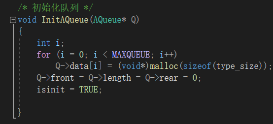
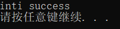
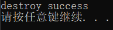
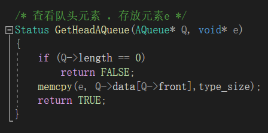
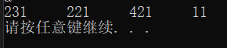

## 																队列   文档

### 一丶作业目的：

​	1.了解并实现循环和链式队列

​	2.了解队列的引用

### 二丶作业要求

​	 实现循环队列和链式队列

​	 交互界面

### 三丶实现分析

​		与栈做对比，分析队列的特点，根据该特点实现代码

​		阅读博客，大致了解重要代码

### 四丶代码设计

##### 			交互功能（详细函数看代码）：

​		Init()   初始化函数  ， IsEmpty（）检查是否空 ，Destroy（）销毁函数， IsFull（）检查是否已满               GetHead（）查看对头元素，En（）入队函数，De（）出队函数。Clear（）清空函数，Traverse（）遍历函数

##### 			其它函数：

​		 SIZE（） 确定数据字节大小，实现泛型

##### 		     公用数据结构设计及说明：

​		typedef struct Aqueue

​		{
​		    void *data[MAXQUEUE];      //数据域
​		    int front;			//头指针
​		    int rear;			//尾指针
​		    int length;        //队列长度
​		} AQueue;

​		typedef struct node
​		{
​		    void *data;                   //数据域指针
​		    struct node *next;            //指向当前结点的下一结点
​		} Node;

​		typedef struct Lqueue
​		{
  		  Node *front;                   //队头
 		   Node *rear;                    //队尾
 		   int length;            //队列长度
​		} LQueue;

​		typedef enum	//枚举——创建类布尔类型
​		{
​		    FALSE = 0, TRUE = 1
​		} Status;

​		char datatype[20];		//数据类型
​		int type_size;				//数据的字节大小
​		Status isA;					//循环或链式队列的选择
​		Status isinit;				 //是否已初始化

### 五丶代码实现			

##### 		1.初始化函数

##### 				

##### 	   实验结果!

##### 2.判断为空

.png)

##### 实验结果

##### .png)

##### 3.摧毁函数

.png)

##### 实验结果

##### 4.是否已满

.png)

##### 实验结果

.png)

##### 5.得到队头

##### 实验结果

.png)

##### 6.队长

.png)

##### 实验结果

.png)

##### 7.入队

.png)

##### 实验结果

.png)

##### 8.出队

.png)

##### 实验结果

.png)

##### 9.清空

.png)

##### 实验结果

.png)

#### 10.遍历

.png)

##### 实验结果

### 六丶体会，总结

##### 	一.存在问题与解决方法

​		问题1：循环队列中，得到队列头元素时，memcpy（e，Q->temp[Q->front],type_size）函数无法将头元素地址写入e。分析：e在外部悬空，无法将某地址写入空地址。解决方法：e不悬空，但e为空类型指针，不能声明后不初始化，所以改为对e进行空间申请。

​		问题2：结构体的成员编译器检测为不是为该结构体成员，无法编译。解决方法：修改编码

​		问题3：中文乱码（暂无解决）

​		问题4：链式队列的遍历失败。分析：入队函数中代码逻辑错误，没有令节点形成链式。解决方法：通过链表方法，创建开辟指针，条理好代码逻辑进行修改。

##### 	二.学习过程与体会

​		本次作业依然以链表，数组为实质，学习新的数据结构——队列，但要求用C语言实现泛型。因为对void*  类型存在知识盲区，对此不太了解，所以开始写起来用了较多的时间查阅博客。期间也因为 void*产生了不少bug，尤其是链式队列中对较多的指针产生混乱。

​		本次作业虽然因没有选做较为轻松，但知识的缺少导致，整体花费时间长，当然也因为其它因素。除了队列的了解，此次的作业也让我体会到了书本上偏冷门但基础的知识的重要性。

### 七丶参考文献

​		CSDN，《C语言程序设计》