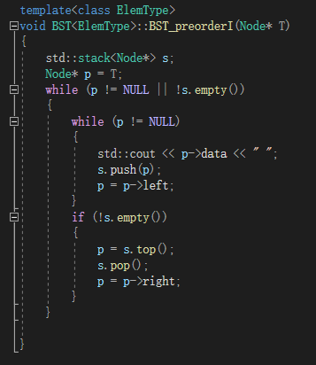

## 																树   文档

### 一丶作业目的：

​	1.了解树

### 二丶作业要求

​	 实现二叉排列树的插入，查找，删除

​	 实现二叉排列树的三种遍历（递归与非递归），以及层序遍历

​	 交互界面

### 三丶实现分析

​		了解二叉排列树的结构

​		了解二叉排列数的遍历规则，并代码实现——先序：根左右，中序：左根右，后序：左右根

### 四丶代码设计

##### 			交互功能（详细函数看代码）：

BST_insert()   插入函数  ，BST_search（）查询函数 ，BST_delete（）删除函数， BST_preorderI（）先序（非递归）函数    BST_preorderR（）先序（递归）函数 ， BST_inorderI（）中序（非递归）函数 ，BST_inorderR（）中序（递归）函数 。BST_postorderI（）后序（非递归）函数 ，BST_postorderR（）后序（递归）函数 

BST_levelOrder（）层序函数

##### 			其它函数：

​		 CreatData() 选择插入，查询，删除功能时，用于输入数据的函数

##### 		     公用数据结构设计及说明：

```c++
private:
typedef struct Node {
	ElemType data;						  //数据域
	struct Node* left, * right,*parent;		//左右孩指针，父指针
}Node;

typedef struct BTNode{
		Node* btnode;		//指针，指向节点
		bool isFirst;		//判断该指针所指节点是否为空
	}BTNode;

public:
	Node* root;      //根
```


### 五丶代码实现			

##### 		1.插入函数

##### 				

​	配合插入函数所用的递归函数


##### 	   实验结果!


​		当前数据：					


#### 注：以下代码测试所用例子为：

#### 	

##### 2.查询函数


​	配合查询函数所用的递归函数


##### 实验结果

##### 

##### 3.删除函数


​	配合删除函数所用的递归函数


##### 实验结果


##### 4.先序（递归）遍历


##### 实验结果


##### 5.先序（非递归）遍历



##### 实验结果


##### 6.中序（递归）遍历


##### 实验结果


##### 7.中序（非递归）遍历


##### 实验结果


##### 8.后序（递归）遍历


##### 实验结果


##### 9.后序（非递归）遍历


##### 实验结果


#### 10.层序遍历


##### 实验结果


11.CreatData（）——辅助于插入，删除，查询功能中


### 六丶体会，总结

##### 	一.存在问题与解决方法

​		问题1：实现插入，或查询，或删除函数后程序崩溃，但遍历选项都不会崩溃.png)

原因很明显，字符串越界。

分析：只有插入，查询，删除会导致，遍历不会，又因为时字符串越界，而程序中只用纠错函数才用得到字符串，所以锁定在纠错函数处。在分析可知，CreatData（）中输入数据时使用了cin>>，保留了回车，导致再次选择功能时进入纠错函数，字符串长度为0，但尝试访问第一个元素，发生崩溃。

解决方法：将CreatData（）中的cin改为getline。实现丢弃回车

但又发现还未解决：选择功能界面处连按两次回车仍会崩溃，分析：纠错函数中也使用了getline（cin，string）输入，导致若不小心按了回车，字符串仍为空，若继续进行任何操作仍越界。解决方法：将getline改为cin


##### 	二.学习过程与体会

​		本次作业虽然是最难的数据结构，但是二叉排列数，其规律规则的实现十分简单，在课上了解后就能代码实现，这也感觉是大组作业中最简单的一次作业，bug也十分的少。

​		这次训练营不仅学习了3种数据结构，对泛型的使用也积累了一定的经验。对下学期的数据结构学习有了一定的信心

### 七丶参考文献

​		CSDN