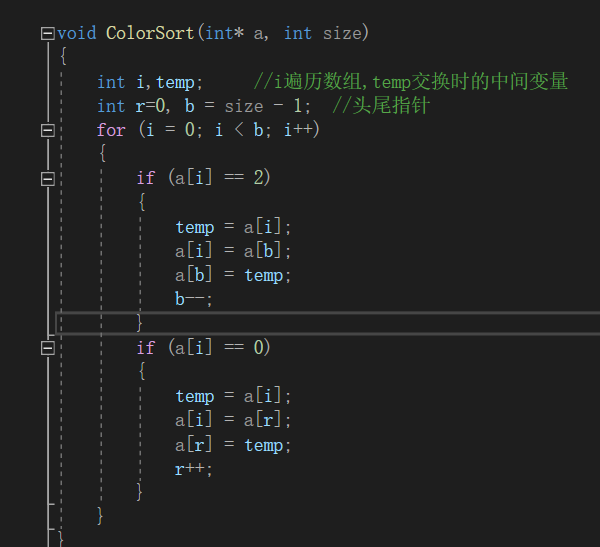

## 第四次大组作业文档

#### 1.作业目的

​	学习排列算法

#### 2.作业要求

​	完成排列函数

​	实现各种数据在不同排列方式下排列

#### 3.学习笔记

各排序图解思路

##### 插入排序

##### 归并排序

​	算法描述

- 把长度为n的输入序列分成两个长度为n/2的子序列；
- 对这两个子序列分别采用归并排序；
- 将两个排序好的子序列合并成一个最终的排序序列。

##### 快速排序

- 从数列中挑出一个元素，称为 “基准”（pivot）；
- 重新排序数列，所有元素比基准值小的摆放在基准前面，所有元素比基准值大的摆在基准的后面（相同的数可以到任一边）。在这个分区退出之后，该基准就处于数列的中间位置。这个称为分区（partition）操作；
- 递归地（recursive）把小于基准值元素的子数列和大于基准值元素的子数列排序。

##### 计数排序

##### 基数排序

- 取得数组中的最大数，并取得位数；
- arr为原始数组，从最低位开始取每个位组成radix数组；
- 对radix进行计数排序

​	

#### 4.函数代码

##### 	插入函数

##### 		归并排序（合并数组）

​										.png)

##### 		归并排序

##### 		快速排序（递归）

##### 			快速排序（非递归）		未完成			

##### 			快速排序（枢轴存放）

##### 			计数排序

##### 				基数计数排序

##### 				颜色排序

##### 			无序中第K大/小个

##### 5.体会心得

​		本身自己对算法的训练十分的少，所以快速排序和计数排序用了一定的时间了解，加上要使用C++的文件处理不熟练，准备工作蛮久。之后就是实操中交换界面的设计，也是因为文件输入输出的要求，逻辑思路比较混乱。

​		代码编写中，基数排列与无序寻找元素的函数中，涉及递归，出现有关指针bug问题，以及文件输入输出的bug，足足花费2个小时解决。所以要加强迭代递归的熟练度

​		作业的要求有关较大数据的使用，出现在检测少数的数据正常，但多数据下出现不少不明的bug。在复杂的交互界面处理十分麻烦。自身以后要多注意代码的使用场景，检测时要用符合使用背景的数据进行测试

##### 6.参考文献

​	CSDN博客，博客园